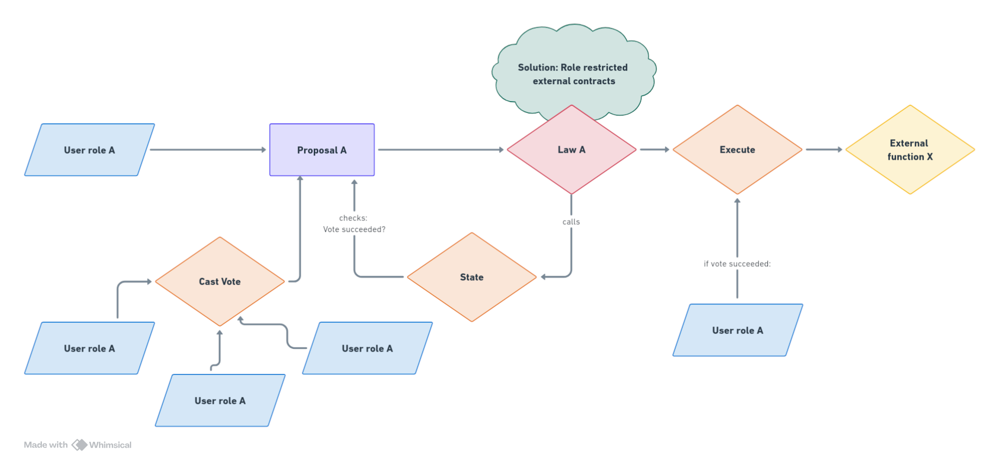
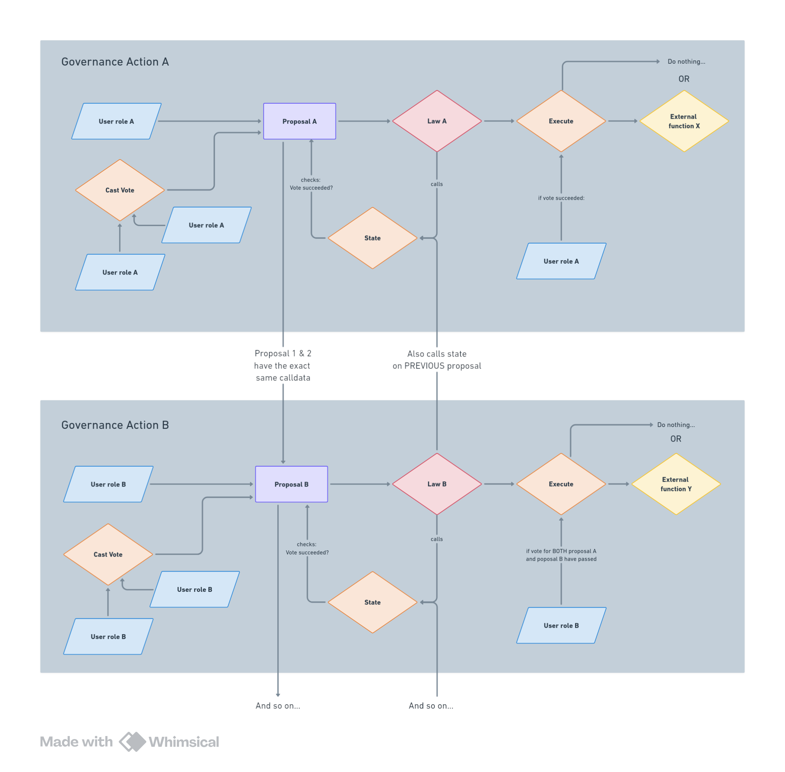

<a name="readme-top"></a>

[![Issues][issues-shield]][issues-url]
[![MIT License][license-shield]][license-url]
[![LinkedIn][linkedin-shield]][linkedin-url]

<!-- PROJECT LOGO -->
<br />
<div align="center">
  <a href="https://github.com/7Cedars/separated-powers"> 
    
  </a>

<h3 align="center">Separated Powers: Introducing separation of powers to DAO Governance </h3>

  <p align="center">
    A protocol providing restricted governance processes for DAOs. 
    <br />
    <a href="https://github.com/7Cedars/separated-powers"><strong>Explore the docs »</strong></a>
    <br />
    <br />
    <!--NB: TO DO --> 
    <a href="https://sepolia.arbiscan.io/">SoP example (Arbiscan)</a>
    ·
    <a href="https://sepolia.arbiscan.io/">SoP example (dApp)</a>
    ·
    <a href="https://github.com/7Cedars/loyalty-program-contracts/issues">Report Bug</a>
    ·
    <a href="https://github.com/7Cedars/loyalty-program-contracts/issues">Request Feature</a>
  </p>
</div>

<div align="center">
For the judges of the RnDAO CollabTech Hackathon  
    <br />
    <a href="https://github.com/7Cedars/separated-powers"> See our pitch here! </a>
    <br />
</div>

<!-- TABLE OF CONTENTS --> 
<!-- NB! Still needs to be adapted --> 
<details>
  <summary>Table of Contents</summary>
  <ol>
    <li>
      <a href="#about">About</a>
      <ul>
        <li><a href="#important-files-and-folders">Important files and folders</a></li>
        <li><a href="#built-with">Built With</a></li>
      </ul>
    </li>
    <li>
      <a href="#getting-started">Getting Started</a>
      <ul>
        <li><a href="#prerequisites">Prerequisites</a></li>
        <li><a href="#installation">Installation</a></li>
      </ul>
    </li>
    <li><a href="#usage">Usage</a></li>
    <li><a href="#roadmap">Roadmap</a></li>
    <li><a href="#contributing">Contributing</a></li>
    <li><a href="#license">License</a></li>
    <li><a href="#contact">Contact</a></li>
    <li><a href="#acknowledgments">Acknowledgments</a></li>
  </ol>
</details>

<!-- ABOUT THE PROJECT -->
## About
Separated Powers restricts governance processes along access roles. 

### What is the problem? 
The centralisation of power in DAO governance. 
- Voting power tends to be centralised around a small group of users with a large amount of (governance) tokens. 
- Voter disengagement among DAO members that do not own large amounts of governance tokens.
- A tendency to centralise governance around a small number of vetted member in order to secure governance against hostile takeovers.

DAOs control crypto that is worth billions of dollars. Still, the amount is tiny when compared to national economies or companies such as Apple. Blockchains will only reach their full potential if they are truly decentralised, give ownership to all their users and provide a safe environment for day-to-day use.  

### What is the solution?
To foster decentralised DAO governance, separated Powers restricts governance processes along access roles. This enables: 
- defining multiple groups within blockchain communities. 
- assigning them restricted powers. 
- balancing and checking powers between groups. 
- creating bespoke incentives for engagement in DAO governance. 

Using roles to separate powers in governance is a tried and true approach to safeguarding decentralisation of (social, political and economic) assets in light of their tendency to centralise around informal elites.

### How does it work? 
To introduce role restrictions to governance processes, the Separated Powers protocol forces all governance actions to refer to whitelisted and role restricted external contracts. 

These contracts 
- are restricted to one role Id. 
- give this role Id privileges to call specific outside functions.
- constrain these privileges through specific conditions. 

Because the role restricted external contracts closely resemble **laws**, they are referred as such throughout the protocol.

Governance actions are only allowed for accounts that hold the role of the target law. An account that holds role A, can only propose proposals, vote on proposals and execute proposals in relation to laws that have access role id A.     

As a flowchart 
  <a href="https://github.com/7Cedars/separated-powers/blob/master/public/SeparatedPowers_introLaws.png"> 
    
  </a>

#### Creating checks and balance 
Crucially, laws allow proposals to be chained. It means that accounts with role A can balance or check decisions of accounts that hold role B.  

Consider the following steps:  
- A user with role A proposes a proposal directed at law A. Its vote succeeds, but nothing happens.   
- A user with role B proposes a proposal directed at law B. The law _only allows the exact same calldata that was included in the proposal to law A_. 
- When a user with role B calls the execute function of law B, it checks if _both_ proposal A and proposal B have passed. If this is the case, the intended action is executed.
- The proposal chain can be made as long as required.

As a flowchart
  <a href="https://github.com/7Cedars/separated-powers/blob/master/public/SeparatedPowers_flowchart.png"> 
    
  </a>

<!-- £todo this still needs proper review -->
#### What does Sop DAO governance look like? 
Laws, role restricted governance processes and chained proposals provide a completely new approach to building DAO governance. As such, they provide a wealth of possibilities. 

- All complexity is abstracted away from the core governance process to a set of laws: guardian roles, queuing proposals, time locks, weighted voting... all are implemented as laws, making DAO governance far more modular. 
- The possibility for checks and balances between roles, creates the incentive to decentralise power in name of security. In contrast, mainstream approach today create an incentive to have a small group of trusted actors 'vet' all decisions. 
- Instead of vertically devolving powers in DAOs to optimise DAO management (see the Hats protocol), Separated Powers devolves powers and responsibilities horizontally. 
- Laws allow for any kind of logic to be encoded into governance. The governance protocol itself is intentionally simple and opinionated, laws are completely open and free. Anything can be build with them.  
- If problems arise with DAO governance, Separated Powers allows for specific laws to be deactivated. It means a DAO does not need to pause its entire governance protocol. Pausing can be selective.  

These are just some examples of the implications of using Separated Powers. Many more can be given.  

#### Gaining a deeper understanding of Separated Powers 
For now, the protocol does not have extensive documentation. It does have extensive natspecs throughout the protocol contracts. 

The best way to gain a deeper understanding of the protocol is to start at `solidity/src/SeparatedPowers.sol` and `solidity/src/ISeparatedPowers.sol` and read through the code and natspecs.  

### Important files and folders

```
.
├── frontend                     # App workspace
|    ├── README.md               # All information needed to run the dApp locally. 
│    └── ...
│
├── public                       # Images
|
├── solidity                     # Contains all the contracts, interfaces and tests. 
│    ├── README.md               # All information needed to run contracts locally, test and deploy contracts.   
│    └── ...                     
| 
├── LICENSE
└── README.md
```

<p align="right">(<a href="#readme-top">back to top</a>)</p>

### Built With
<!-- See for a list of badges: https://github.com/Envoy-VC/awesome-badges -->
<!-- * [![React][React.js]][React-url]  -->
* Solidity 0.8.26
* Foundry 0.2.0
* OpenZeppelin 5.0.2

<p align="right">(<a href="#readme-top">back to top</a>)</p>

<!-- LICENSE -->
## License

Distributed under the MIT License. See `LICENSE.txt` for more information.

<p align="right">(<a href="#readme-top">back to top</a>)</p>

<!-- CONTACT -->
## Contact

Seven Cedars - [Github profile](https://github.com/7Cedars) - cedars7@proton.me

Niy42 - [Github profile](https://github.com/niy42)

<p align="right">(<a href="#readme-top">back to top</a>)</p>


<!-- MARKDOWN LINKS & IMAGES -->
[issues-shield]: https://img.shields.io/github/issues/7Cedars/loyalty-program-contracts.svg?style=for-the-badge
[issues-url]: https://github.com/7Cedars/loyalty-program-contracts/issues/
[license-shield]: https://img.shields.io/github/license/7Cedars/loyalty-program-contracts.svg?style=for-the-badge
[license-url]: https://github.com/7Cedars/loyalty-program-contracts/LICENSE.txt
[linkedin-shield]: https://img.shields.io/badge/-LinkedIn-black.svg?style=for-the-badge&logo=linkedin&colorB=555
[linkedin-url]: https://linkedin.com/in/linkedin_username
[product-screenshot]: images/screenshot.png
<!-- See list of icons here: https://hendrasob.github.io/badges/ -->
[Next.js]: https://img.shields.io/badge/next.js-000000?style=for-the-badge&logo=nextdotjs&logoColor=white
[Next-url]: https://nextjs.org/
[React.js]: https://img.shields.io/badge/React-20232A?style=for-the-badge&logo=react&logoColor=61DAFB
[React-url]: https://reactjs.org/
[Tailwind-css]: https://img.shields.io/badge/Tailwind_CSS-38B2AC?style=for-the-badge&logo=tailwind-css&logoColor=white
[Tailwind-url]: https://tailwindcss.com/
[Vue.js]: https://img.shields.io/badge/Vue.js-35495E?style=for-the-badge&logo=vuedotjs&logoColor=4FC08D
[Redux]: https://img.shields.io/badge/Redux-593D88?style=for-the-badge&logo=redux&logoColor=white
[Redux-url]: https://redux.js.org/
[Vue-url]: https://vuejs.org/
[Angular.io]: https://img.shields.io/badge/Angular-DD0031?style=for-the-badge&logo=angular&logoColor=white
[Angular-url]: https://angular.io/
[Svelte.dev]: https://img.shields.io/badge/Svelte-4A4A55?style=for-the-badge&logo=svelte&logoColor=FF3E00
[Svelte-url]: https://svelte.dev/
[Laravel.com]: https://img.shields.io/badge/Laravel-FF2D20?style=for-the-badge&logo=laravel&logoColor=white
[Laravel-url]: https://laravel.com
[Bootstrap.com]: https://img.shields.io/badge/Bootstrap-563D7C?style=for-the-badge&logo=bootstrap&logoColor=white
[Bootstrap-url]: https://getbootstrap.com
[JQuery.com]: https://img.shields.io/badge/jQuery-0769AD?style=for-the-badge&logo=jquery&logoColor=white
[JQuery-url]: https://jquery.com 
